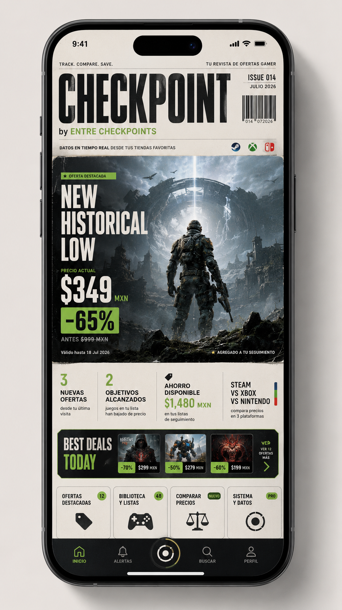

# Checkpoint by Entre Checkpoints — Android 1.0.3

Checkpoint es una aplicación Android nativa para vigilar precios de videojuegos en **Nintendo eShop, Steam y Xbox Store**, comparar tiendas, administrar una biblioteca personal y recibir alertas inteligentes.

La versión 1.0 presenta la información como una **portada editorial dinámica** inspirada en revistas de videojuegos de mediados de los 2000. La portada se construye con juegos, precios, descuentos, objetivos, eventos e historial guardados en el teléfono; no es una imagen estática colocada encima de una app convencional con peluca.

Checkpoint funciona localmente, no requiere una cuenta propia, no incluye telemetría y no se sincroniza con la extensión de Chrome.



## Novedad en 1.0.3: wishlists de Steam y Nintendo

Checkpoint puede importar:

### Steam

- Wishlist pública con `store.steampowered.com/wishlist/profiles/...`.
- Wishlist pública con `store.steampowered.com/wishlist/id/...`.
- Perfil público de Steam Community.
- App IDs, uno por línea.
- JSON copiado desde una respuesta de wishlist.
- Enlaces individuales de productos.

La wishlist debe estar configurada como pública.

### Nintendo

- Enlaces oficiales compartidos con la ruta:

```text
https://www.nintendo.com/es-mx/wish-list/share/#skus=...
```

Checkpoint lee del enlace:

- SKU de cada producto.
- Región e idioma de la tienda.
- Orden original de los productos.
- Fecha incluida en la captura compartida.

Como Nintendo genera los productos mediante JavaScript, Checkpoint abre temporalmente esa página pública en un WebView aislado, activa la carga diferida y obtiene los enlaces reales de cada ficha. No solicita usuario ni contraseña. Mantén la app abierta mientras termina la importación, especialmente con listas grandes.

### Xbox

Xbox continúa admitiendo enlaces individuales. Su wishlist no se importa automáticamente.

## Live Magazine Edition

Al abrir la aplicación, Inicio muestra una portada viva con:

- Masthead `CHECKPOINT by ENTRE CHECKPOINTS`.
- Número de edición diario y código de barras local.
- Juego destacado según Deal Score, eventos, descuento y objetivos.
- Titulares como `NEW HISTORICAL LOW`, `TARGET REACHED`, `ENDING SOON` y `BEST DEAL TODAY`.
- Arte, precio actual, precio anterior y porcentaje de descuento.
- Nuevas ofertas, objetivos alcanzados y ahorro disponible.
- Carrusel **Best Deals Today**.
- Panel **Price Pulse** con movimiento general de la lista.

La búsqueda, los filtros y la lista completa continúan debajo de la portada. Las funciones avanzadas viven en sus propias secciones, lejos de la tradición humana de poner veinte botones en la primera pantalla y esperar armonía.

## Secciones

- **Inicio:** portada dinámica, ofertas destacadas, Price Pulse y seguimiento.
- **Ofertas:** feed de bajadas, mínimos, objetivos y promociones.
- **Comparar:** precios del mismo juego y edición entre tiendas.
- **Biblioteca:** estados, compras, notas, formato, calificación y presupuesto.
- **Sistema:** temas, automatización, suscripciones, fuentes, importación y respaldos.

## Funciones principales

### Seguimiento y alertas

- Agregar productos mediante URL.
- Recibir enlaces con **Compartir → Checkpoint** desde Android.
- Actualización manual y periódica mediante WorkManager.
- Alertas por bajada, objetivo, mínimo, descuento, cantidad reducida y fin de oferta.
- Conservación del último precio válido cuando una fuente falla.

### Análisis

- Precio mínimo, máximo y promedio local.
- Deal Score de 0 a 10.
- Gráfica histórica.
- Pronóstico heurístico de próximas ofertas.
- Comparación multitienda por juego y edición.

### Organización

- Importación masiva de listas y enlaces.
- Biblioteca: deseado, comprado, jugando, terminado y abandonado.
- Precio pagado, fecha de compra, formato, calificación y notas.
- Presupuesto mensual y combinación sugerida de compras.
- Suscripciones: Game Pass, EA Play, Ubisoft+, PlayStation Plus y Nintendo Switch Online.

### Apariencia

- Editorial Y2K.
- After Dark.
- Frutiger Aero.
- Arcade Neon.

## Actualización

No se modificó el esquema de Room ni el formato de respaldo. Juegos, historial, eventos, objetivos, biblioteca, presupuesto y tema se conservan al instalar un APK firmado con la misma clave.

```text
versionName 1.0.3
versionCode 9
```

## Compilar en GitHub Actions

1. Sube el contenido del proyecto a la raíz del repositorio.
2. Comprueba que exista `.github/workflows/android.yml`.
3. Abre **Actions → Build Checkpoint APK**.
4. Pulsa **Run workflow** o realiza un commit en `main`.
5. Descarga `checkpoint-android-v1.0.3-debug`.
6. Extrae `app-debug.apk`.

## Publicar en GitHub Releases

El proyecto incluye `.github/workflows/release-apk.yml`.

1. Abre **Actions → Publicar Checkpoint APK**.
2. Pulsa **Run workflow**.
3. Escribe `v1.0.3`.
4. GitHub crea una Release con `Checkpoint.apk` y `Checkpoint.apk.sha256`.

El APK debug utiliza la clave de desarrollo incluida para permitir actualizaciones entre compilaciones del proyecto. No debe utilizarse como firma definitiva de Google Play.

## Compilar localmente

Requisitos:

- Android Studio reciente.
- JDK 17.
- Android SDK 35.
- Build Tools 35.x.

Windows:

```bat
scripts\build-apk.bat
```

Linux o macOS:

```bash
./scripts/build-apk.sh
```

APK generado:

```text
app/build/outputs/apk/debug/app-debug.apk
```

## Limitaciones

- El importador de Nintendo depende de que la página pública compartida siga exponiendo fichas navegables después de ejecutarse su JavaScript.
- La importación de una lista grande puede tardar mientras Nintendo carga sus productos y Checkpoint consulta cada ficha.
- El dispositivo necesita un proveedor Android System WebView habilitado.
- Xbox continúa en beta y solo admite enlaces individuales para importación masiva.
- El historial representa los datos reunidos por Checkpoint, no el historial global de SteamDB.
- El pronóstico necesita varios ciclos reales de precio.
- Android puede retrasar WorkManager para ahorrar batería.
- El ahorro de portada utiliza una sola moneda para no sumar pesos, dólares y yenes como si la contabilidad fuese una sugerencia.

Consulta [CHANGELOG.md](CHANGELOG.md) para el historial completo desde 0.1.0 hasta 1.0.3.
